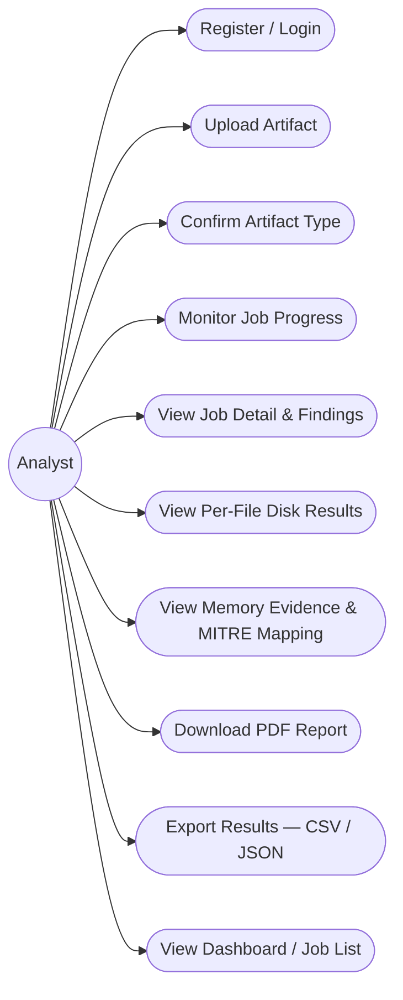
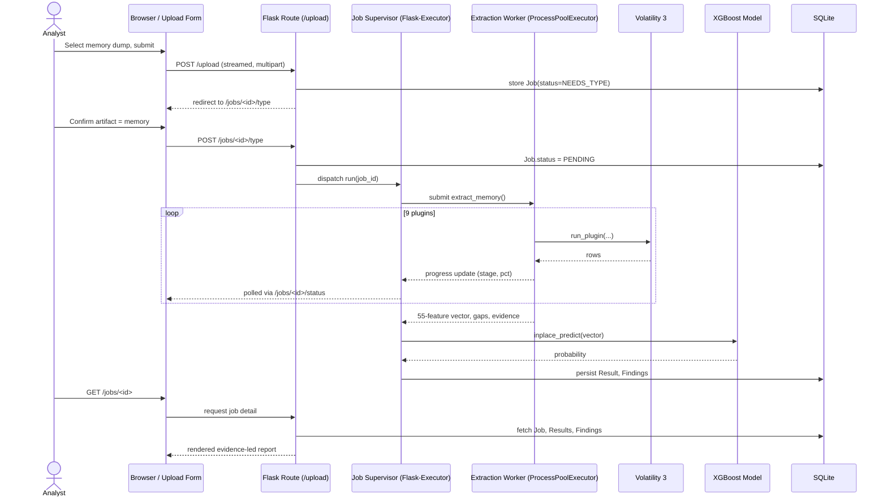
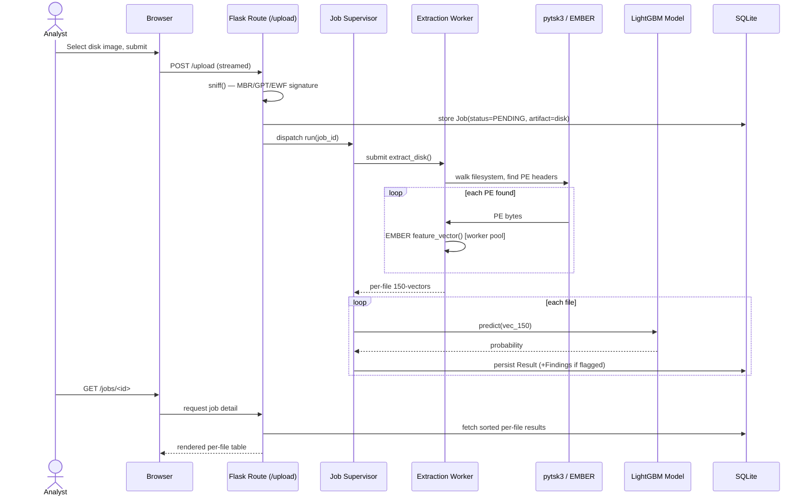
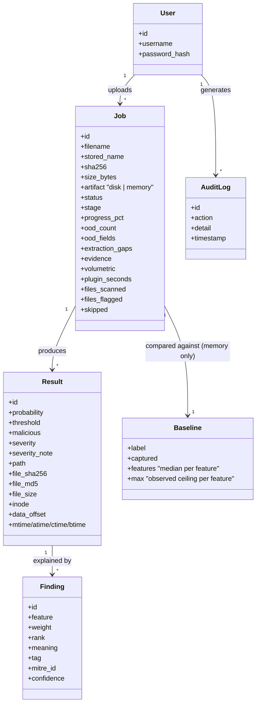
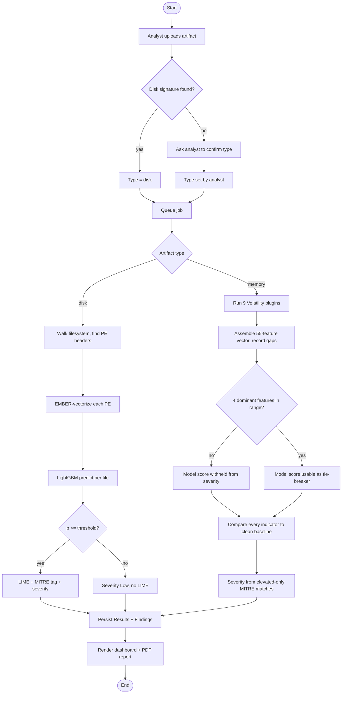
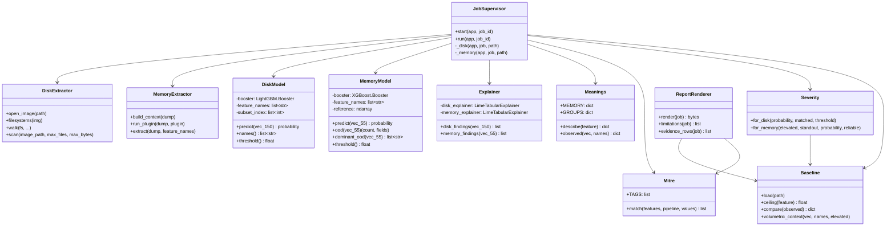
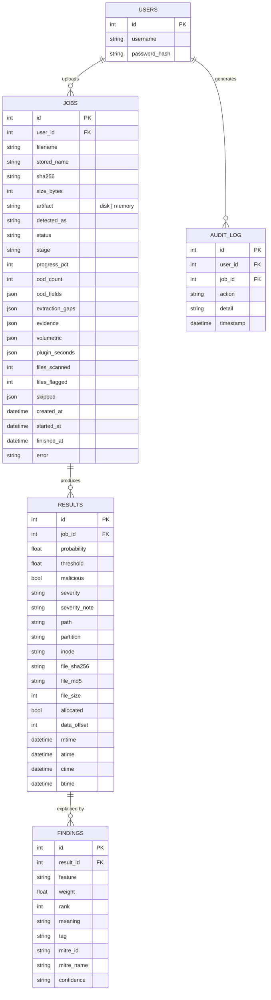
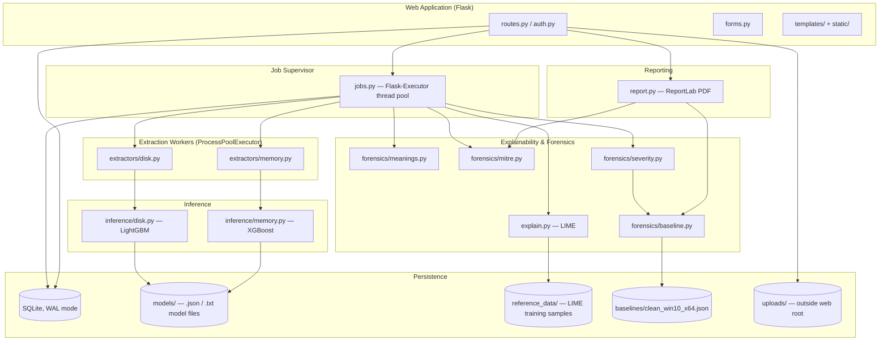
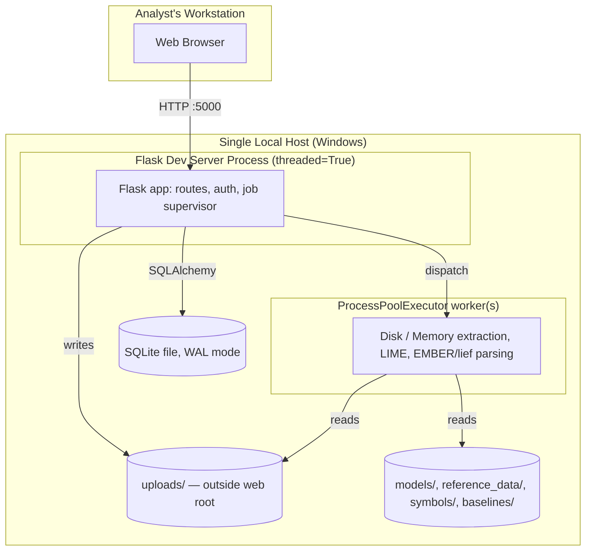

# DRAFT — Final Year Project Report

**This file is a content draft for the FYP dissertation, not the final formatted document.**
It follows the structure mandated by `FYP Report Checklist.pdf` and `FYP Report Writing
Instructions.pdf` (IIU Faculty of Computing, Dept. of CS&SE). The e-commerce report
supplied alongside those two files was a formatting *reference only* — none of its content
belongs to this project; this draft describes the actual system built and documented in
`CLAUDE.md` / `STATUS.md`.

**Before this goes into the Word template, the following still need action** (flagged again
at point of use below):
1. Supervisor's name is not recorded anywhere in the project files I have access to — insert
   it on the title page, final approval page, and dedication.
2. Final Approval page needs the External/Internal Examiner names and the viva date —
   left blank per the university template, filled in after the committee is assigned.
3. Diagrams below are given as **Mermaid source**, chosen because it renders directly and
   is easy to verify against the actual schema/code rather than being redrawn by hand and
   risking drift from what was built. For the submitted Word document, render each block
   (e.g. via the Mermaid Live Editor or a `mermaid-cli` export) to PNG/SVG at print
   resolution and insert as a captioned Figure, per Special Component 1 in the writing
   instructions.
4. Formatting (margins, fonts, roman-numeral front matter, chapter separator pages,
   headers/footers) must be applied in Word directly — this draft supplies structure and
   content only. The exact rules are restated at each section as a checklist comment.
5. Chapter 5 test statuses below are marked Pass/Fail from **artifacts actually run this
   session** (`malicious_1.raw`, `demo_upx_disk.img`, the 232-test pytest suite) — these are
   not placeholders, unlike a report written before the system was exercised.

---

# Front Matter

## Title Page

> Format per instructions: project name 18–20pt bold; university monogram 2–2.25" centred;
> *Developed by* in italic 12–14pt followed by names 14–16pt bold; *Supervised by* likewise;
> department/university/year in 16–18pt non-bold near the bottom. A duplicate title page
> goes inside the front cover.

**Automated Malware Analysis System for Disk & Memory Forensics**

*Developed by*
Muhammad Farooq — 831-FOC/BSIT/F22
Mukhbit Ilahi — 955-FOC/BSIT/F22

*Supervised by*
**[Supervisor name — insert]**

Department of Computer Science
Faculty of Computing and Information Technology
International Islamic University, Islamabad
Fall 2025

## Bismillah Page

"In the Name of Allah, the Most Beneficent, the Most Merciful"

## Final Approval

> Exact template format required; only names/designations/date change.

FINAL APPROVAL

Date: ______________

It is certified that we have read the Project Report titled **"Automated Malware Analysis
System for Disk & Memory Forensics"** submitted by **Muhammad Farooq
(831-FOC/BSIT/F22)** and **Mukhbit Ilahi (955-FOC/BSIT/F22)**. It is our judgement that
this project is of sufficient standard to justify its acceptance by International Islamic
University, Islamabad for the Bachelor's Degree in Information Technology.

COMMITTEE

External Examiner: ___________________
[Designation / Department / University]

Internal Examiner: ___________________
[Designation / Department / University]

Supervisor: ___________________
**[Supervisor name]**
[Designation] / Department of Computer Science / Faculty of Computing and IT /
International Islamic University, Islamabad

## Dedication

Free text — student's choice. Suggested wording:

*We dedicate this work to our parents, whose support made this project possible, and to our
supervisor, [Supervisor name], for guidance throughout.*

## Dissertation (Degree Requirement)

A dissertation submitted to
Department of Computer Science, Faculty of Computing and Information Technology,
International Islamic University, Islamabad
As partial fulfilment of the requirements
For award of the degree of
Bachelors in Information Technology.

## Declaration

We hereby declare that the development of this project and this report is thoroughly based
on our personal efforts and learning accomplished under the absolute support and sincere
guidance of our project supervisor **[Supervisor name]**. No portion of the work presented
in this report has been submitted in support of our applications for any other degree or any
other university or institute of learning. We further declare that this project, all code, and
associated documents and reports are submitted as partial requirements for the degree of
Bachelors of Science in Information Technology.

Muhammad Farooq — 831-FOC/BSIT/F22
Mukhbit Ilahi — 955-FOC/BSIT/F22

## Acknowledgement

Free text — student's choice. The supervisor and any lab assistants who supported symbol
acquisition, capture sessions, or environment setup would be the natural people to name.

## Project in Brief

| Field | Value |
|---|---|
| Project Title | Automated Malware Analysis System for Disk & Memory Forensics |
| Version | 1.0 |
| Undertaken By | Muhammad Farooq, Mukhbit Ilahi |
| Supervised By | [Supervisor name] |
| Date Started | [insert — project's git history begins with environment setup] |
| Date Completed | August 2026 |
| Tools, Technologies and Languages Used | Python 3.11.9, Flask, SQLAlchemy, Flask-Executor, Volatility 3, pytsk3, libewf-python (E01), EMBER (LightGBM/XGBoost), LIME, ReportLab, SQLite (WAL), HTML5/Bootstrap/Chart.js, PyTest |
| System Used | [insert lab/dev machine spec] |

## Abstract

Digital forensic analysts investigating a compromised machine are handed raw evidence —
a disk image or a memory dump — and expected to run the correct toolchain (Sleuth Kit,
Volatility, EMBER-style feature extraction) by hand before any classification model can be
applied. This project removes that manual step. It is a locally-run web application that
accepts a raw disk image or raw memory dump directly, extracts the required features
itself, classifies them with a pre-trained model, and produces an analyst-readable forensic
report explaining what was found and why — without the analyst ever touching Volatility,
Sleuth Kit, or a feature CSV by hand.

The system runs two independent pipelines that share only the web application, database,
and report generator. The **disk pipeline** walks a raw or EWF/E01 image with `pytsk3`,
identifies executables by PE header rather than file extension, vectorises each with EMBER's
2,381-feature extractor, and classifies the reduced 150-feature subset with a LightGBM
model (ROC-AUC 0.9940 against the official EMBER 2018 test-set baseline of 0.9964). The
**memory pipeline** runs nine Volatility 3 plugins over a Windows 10 x64 dump, assembles
the 55 features CIC-MalMem-2022 was trained on, and classifies with an XGBoost model.
Investigation during this project traced that dataset's benign half to substantial SMOTE
interpolation, which explains its reported 1.0000 test AUC and means the model's raw
probability is unreliable on any real capture; the memory pipeline was therefore repositioned
as an **evidence-led forensic triage engine** rather than a detector — its report leads with
directly observed Volatility findings (injected memory regions, hidden processes, loader-list
anomalies), scored against a seven-capture clean baseline of the reference machine, with the
model's score demoted to a secondary, out-of-distribution-gated signal.

Both pipelines were validated on real, ground-truth artefacts rather than only on held-out
dataset rows. A controlled malicious memory capture — benign simulation tools producing
30 injected RWX regions and ~100 pinned zombie processes — was extracted, scored
**Critical** by the evidence-led severity engine (Process Injection + Rootkit/Hidden Artefacts,
confirmed independently and shown robust to indicator reduction), and rendered into a report
that correctly attributes the verdict to the behavioural evidence rather than the (deliberately
withheld, out-of-distribution) model score. A controlled disk image containing two
UPX-packed and two clean Windows executables, built without any real malware, was
correctly split by the disk pipeline: both packed files flagged (p = 0.6607 and 0.5441,
matching an earlier independent measurement to four decimal places) and both clean files
correctly passed. Every flagged file is reported with its full image path and SHA-256 so an
analyst can retrieve and independently verify it. Explainability (LIME), MITRE ATT&CK
technique mapping, and a deterministic severity function are attached to every verdict so the
report is auditable rather than a bare probability.

---

# Table of Contents

*(Generated from the headings below once the document is assembled in Word; page numbers
to be filled after final pagination. Third-level headings included per the writing
instructions.)*

---

# Chapter 1 — Introduction

> Chapter separator page: chapter number + name, 16–18pt bold, own page.
> Chapter title 16–18pt bold; open with 1–2 introductory paragraphs before 1.1.

Digital forensics increasingly begins with a very large, very slow first step: given a raw disk
image or a memory dump seized from a suspect machine, an analyst must first run the correct
extraction toolchain — Sleuth Kit for a filesystem, Volatility for a memory dump, a
feature-hashing extractor for executable classification — before any automated
classification is even possible. Each of those tools has its own command-line interface, its
own output format, and its own failure modes, and stitching them into a usable verdict is
manual, repetitive work that does not scale with the number of images an investigation
produces.

This chapter introduces the problem this project addresses, the two independent AI
pipelines built to address it, and the scope within which the resulting system is meant to be
used.

## 1.1 Background

Disk-image and memory-dump analysis rely on two long-standing, mature open-source
toolchains: **The Sleuth Kit** (via its Python binding `pytsk3`) for filesystem-level disk
forensics, and **Volatility 3** for memory forensics. Both are libraries/CLIs, not
classifiers — they recover files, processes, and structures, but assign no verdict. Machine
-learning malware classification separately has two well-studied public benchmarks this
project builds on: **EMBER 2018** (Elastic, static PE feature vectors, 2,381 features per
file) for disk-side classification, and **CIC-MalMem-2022** (Canadian Institute for
Cybersecurity, 55 features derived from Volatility 2 plugin output) for memory-side
classification. Neither benchmark ships an extraction pipeline that goes from a raw artefact
to a feature vector automatically against a *real*, uncurated capture — that gap is what this
project fills.

## 1.2 Problem Statement

An analyst handed a raw disk image or memory dump has no automated path from that
artefact to a trustworthy verdict. They must manually run Sleuth Kit or Volatility, manually
derive the correct feature vector for a pre-trained model (a process that is itself
undocumented and error-prone — Volatility's plugin output format has changed between
major versions, and its column semantics are not always self-evident), manually invoke the
model, and manually interpret a bare probability with no explanation of which features
drove it, no forensic context, and no indication of whether the model is even operating
within the range of inputs it was trained on. Existing published models (EMBER's own
baseline classifier, and the classifier trained on CIC-MalMem-2022) are validated only on
their own held-out test rows — neither has been demonstrated end-to-end against a raw
artefact acquired outside the training pipeline, and a naive deployment of either would
silently mis-predict if the feature vector were assembled in the wrong order, since the
underlying LightGBM/XGBoost models offer no built-in name-based validation guarantee
strong enough to catch it in every case.

## 1.3 Proposed Solution

This project builds a locally-run web application with two independent, purpose-built
pipelines:

- **Disk pipeline** — opens a raw or EWF/E01 image with `pytsk3`/`pyewf`, walks every
  filesystem it finds (with or without a partition table), identifies executables by
  `MZ`/`PE\0\0` header (never by file extension), vectorises each with EMBER's published
  feature extractor, subsets to the 150 features the shipped LightGBM model actually uses,
  and predicts per file.
- **Memory pipeline** — runs nine Volatility 3 plugins over a Windows 10 x64 dump,
  assembles the 55 CIC-MalMem-2022 features from their outputs (a mapping this project
  had to derive largely by measurement, since Volatility 2 and 3 differ in plugin output and
  the original dataset authors never published their derivation), and predicts with the
  shipped XGBoost model.

Both pipelines attach an explainability layer (LIME), a MITRE ATT&CK technique
mapping, and a deterministic, disclosed severity score, and both render a PDF forensic
report with a mandatory limitations section, so the output is a starting point for
investigation rather than a black-box verdict.

## 1.4 Product Overview

The system is a Flask web application. An authenticated analyst uploads a raw artefact; the
system streams it to disk while hashing it, positively identifies it as disk or memory where
possible (MBR/GPT/EWF signature for disk; falling back to asking the analyst when no
signature is present, since raw memory dumps carry no reliable magic bytes), and queues a
background extraction-and-classification job. Progress is reported live while extraction
runs (this takes minutes, not seconds — a Windows 10 memory dump measured 180–410
seconds through the full pipeline in this project's own testing). On completion the analyst
gets a dashboard view, a downloadable PDF report, and CSV/JSON export of per-result data.

## 1.5 Aims / Objectives

- Build a disk-image pipeline that goes from raw bytes to a per-file verdict without any
  manual feature-vector construction step.
- Build a memory-dump pipeline that goes from a raw capture to a set of forensic findings
  without any manual Volatility invocation.
- Attach explainability (LIME) and a defensible MITRE ATT&CK mapping to every
  malicious verdict, rather than a bare probability.
- Detect and disclose when either model is operating outside the distribution it was
  trained on, rather than presenting an out-of-range prediction as trustworthy.
- Validate both pipelines against real, ground-truth artefacts — not only against held-out
  rows from the original training datasets — before calling either pipeline done.
- Produce a forensic PDF report with a mandatory, non-optional limitations section.

## 1.6 Project Scope

**In scope:** disk-image analysis (raw/dd/img and EWF/E01 containers, any filesystem
`pytsk3` recognises); memory-dump analysis for **Windows 10 x64 only**, matching the
capture environment CIC-MalMem-2022 was built on; per-file disk verdicts with full path
and SHA-256; evidence-led memory findings scored against a per-machine clean baseline;
PDF/CSV/JSON reporting; local, single-host deployment with no cloud dependency.

**Out of scope, by deliberate decision, not oversight:** live/real-time acquisition (the
analyst uploads an already-captured artefact); malware family classification (replaced with
indicator tagging + MITRE mapping); reverse engineering or disassembly; non-Windows
malware; memory analysis of any Windows build other than the reference 10 x64 machine
without first establishing a new per-machine baseline; cloud deployment, containers, or
multi-node scale; retraining or otherwise modifying either shipped model.

## 1.7 User Descriptions

The system has a single user role — **Analyst**. There is no separate administrator or
reviewer role; every authenticated user can upload artefacts, monitor jobs, and read reports.
Access control exists at the account level (an analyst can only see their own jobs) rather
than at a role level, since the project's scope is a single-analyst or small-team lab tool, not a
multi-tenant case-management system.

## 1.8 Features

- Streamed, hashed upload of multi-gigabyte disk images and memory dumps, with a
  positive-identification sniff step and a manual-confirmation fallback when the artefact
  type cannot be determined from its bytes.
- Background job processing (thread-pool supervisor + process-pool extraction workers)
  with live progress reporting.
- Disk: per-file PE detection by header, EMBER feature vectorisation, LightGBM
  classification, per-file SHA-256/MD5/MACB/inode/byte-offset reporting.
- Memory: nine-plugin Volatility 3 extraction, 55-feature assembly with an honestly
  disclosed extraction-gap list, XGBoost classification, out-of-distribution detection.
- LIME-based explainability, resolved against a maintained feature-meaning lookup table
  rather than raw model internals.
- A small, defensible MITRE ATT&CK technique-mapping table, applied only where the
  underlying feature semantics genuinely support the mapping.
- Deterministic, disclosed severity scoring — verdict-led for disk, evidence-led for
  memory (a clean-baseline comparison, not the raw model probability, drives memory
  severity).
- PDF report generation with a mandatory limitations section; CSV/JSON export.
- Standard account security: hashed passwords, CSRF protection, upload-path validation,
  rate limiting, audit logging, and artefacts stored outside the web root and never served.

## 1.9 Implementation Tools, Technologies and Languages

| Technology | Purpose |
|---|---|
| Python 3.11.9 | Application and extraction language |
| Flask, Flask-SQLAlchemy, Flask-Login, Flask-WTF, Flask-Executor, Flask-Migrate, Flask-Limiter | Web application framework and supporting extensions |
| SQLAlchemy 2.x / SQLite (WAL mode) | Data persistence |
| `pytsk3`, `libewf-python` | Disk-image filesystem access (raw and EWF/E01) |
| EMBER (`ember/features.py`, patched) | Static PE feature extraction (2,381 features) |
| `lief` 1.0.0 | PE parsing, used inside EMBER's extractor |
| LightGBM 4.6.0 | Disk-pipeline classifier (150 of 2,381 EMBER features) |
| Volatility 3 (`volatility3` 2.28.0) | Memory-dump extraction (nine plugins) |
| XGBoost 3.2.0 | Memory-pipeline classifier (55 features) |
| LIME 0.2.0.1 | Per-prediction explainability |
| ReportLab | PDF report rendering (pure Python, no native GTK dependency) |
| HTML5 / Bootstrap / vanilla JS / Chart.js | Dashboard front end (vendored, offline) |
| PyTest, `pytest-flask` | Automated test suite (232 tests at time of writing) |
| `concurrent.futures.ProcessPoolExecutor` | Isolates native PE/memory parsing from the web process |

## 1.10 Definitions, Acronyms and Abbreviations

| Acronym | Description |
|---|---|
| PE | Portable Executable — the Windows executable file format |
| EWF | Expert Witness Format — the `.E01` forensic disk-image container |
| MFT | Master File Table (NTFS) |
| MACB | Modified / Accessed / Changed / Born — filesystem timestamp set |
| OOD | Out-of-Distribution — an input falling outside a model's training range |
| LIME | Local Interpretable Model-agnostic Explanations |
| SMOTE | Synthetic Minority Over-sampling Technique |
| ROC-AUC | Receiver Operating Characteristic — Area Under Curve |
| MITRE ATT&CK | A public knowledge base of adversary tactics and techniques |
| VAD | Virtual Address Descriptor (Windows memory management structure) |
| PEB | Process Environment Block (Windows) |
| EPROCESS | The kernel object representing a Windows process |
| WAL | Write-Ahead Logging (SQLite journal mode) |
| CSRF | Cross-Site Request Forgery |

---

# Chapter 2 — System Analysis

> Chapter separator page. Mandatory artefacts: use case diagram, brief + detailed use case
> descriptions, system sequence diagrams, domain/conceptual model. Optional: operation
> contracts, activity diagrams (both included below for completeness).

## 2.1 Use Case Model

### 2.1.1 Use Case Diagram



### 2.1.2 Use Case Descriptions — Brief Format

| ID | Name | Description |
|---|---|---|
| UC-01 | Register / Login | Analyst creates an account or authenticates to reach the dashboard. |
| UC-02 | Upload Artifact | Analyst uploads a raw disk image or memory dump; system streams, hashes, and positively identifies its type. |
| UC-03 | Confirm Artifact Type | When the artefact's type cannot be determined from its bytes (typical for raw memory), the analyst confirms it manually. |
| UC-04 | Monitor Job Progress | Analyst watches live per-plugin/per-file progress while a queued job runs. |
| UC-05 | View Job Detail & Findings | Analyst reviews the completed job's verdict, severity, and matched forensic indicators. |
| UC-06 | View Per-File Disk Results | For a disk job, analyst reviews the sorted, per-executable table with path, hash, and verdict. |
| UC-07 | View Memory Evidence & MITRE Mapping | For a memory job, analyst reviews the evidence-led findings (injected regions, hidden processes, etc.) and their MITRE technique tags. |
| UC-08 | Download PDF Report | Analyst downloads the rendered forensic PDF, including the mandatory limitations section. |
| UC-09 | Export Results | Analyst exports the job's results as CSV or JSON for use in other tooling. |
| UC-10 | View Dashboard / Job List | Analyst sees all their own jobs, status, and aggregate severity counts. |

### 2.1.3 Use Case Descriptions — Detailed Expanded Format

**Use Case Specification – Upload Artifact (UC-02)**

| Field | Description |
|---|---|
| Use Case ID | UC-02 |
| Use Case Name | Upload Artifact |
| Primary Actor | Analyst |
| Description | The analyst uploads a raw disk image or memory dump for analysis. |
| Pre-conditions | Analyst is authenticated. File extension is on the allowed list (`.dd`, `.raw`, `.img`, `.e01`, `.ex01`, `.mem`, `.dmp`, `.vmem`). Sufficient free disk space exists (the upload transiently needs roughly 2× the artefact's size). |
| Post-conditions | The artefact is stored outside the web root under a randomly generated name; its SHA-256 is recorded; a job row is created and, if the type was positively identified, queued for background processing. |
| Basic Flow | 1. Analyst selects a file and submits the upload form. <br>2. System streams the file to storage in fixed-size chunks, computing SHA-256 incrementally so the multi-GB file is never held fully in memory. <br>3. System inspects the stored bytes for a disk signature (EWF magic, GPT header, or MBR boot signature). <br>4. If a signature is found, the artefact is typed automatically and the job is queued immediately. <br>5. Analyst is redirected to the job detail page with an "analysis takes minutes, not seconds" notice. |
| Alternative Flow | No disk signature is found (the normal case for a raw memory dump, which carries no reliable magic bytes) → job status becomes `NEEDS_TYPE` and control passes to UC-03. Extension not on the allowlist → upload rejected with a flash message, nothing is stored. |

**Use Case Specification – Confirm Artifact Type (UC-03)**

| Field | Description |
|---|---|
| Use Case ID | UC-03 |
| Use Case Name | Confirm Artifact Type |
| Primary Actor | Analyst |
| Description | The analyst manually states whether an uploaded artefact is a disk image or a memory dump, when the system could not determine this from the bytes alone. |
| Pre-conditions | A job exists in `NEEDS_TYPE` status, owned by this analyst. |
| Post-conditions | The job's artefact type is set; the job is queued for processing. |
| Basic Flow | 1. Analyst opens the pending job and is shown a type-selection form. <br>2. Analyst selects Disk or Memory. <br>3. System records the choice (and that it was analyst-confirmed rather than sniffed), sets status to `PENDING`, and dispatches the job. |
| Alternative Flow | None — the form requires a selection before submission. |

**Use Case Specification – Monitor Job Progress (UC-04)**

| Field | Description |
|---|---|
| Use Case ID | UC-04 |
| Use Case Name | Monitor Job Progress |
| Primary Actor | Analyst |
| Description | The analyst watches a running job's live progress. |
| Pre-conditions | A job is queued or running. |
| Post-conditions | Analyst sees current stage (e.g. "Running windows.malfind.Malfind (5 of 9)") and percentage complete; on completion, is shown the settled status. |
| Basic Flow | 1. Job detail page polls the job's status endpoint at a fixed interval. <br>2. Endpoint returns current status, stage text, and progress percentage, read from a small progress file the extraction worker updates independently of the request/response cycle. <br>3. Page updates in place until the job reaches a terminal status. |
| Alternative Flow | Job fails (extraction error, timeout, or the server having restarted mid-job) → status shown as `FAILED` with a readable error message rather than left spinning indefinitely. |

**Use Case Specification – View Job Detail & Findings (UC-05)**

| Field | Description |
|---|---|
| Use Case ID | UC-05 |
| Use Case Name | View Job Detail & Findings |
| Primary Actor | Analyst |
| Description | The analyst reviews a completed job's verdict, severity, and the forensic indicators behind it. |
| Pre-conditions | Job status is `COMPLETED`, owned by this analyst. |
| Post-conditions | Analyst sees the model verdict/probability (with its operating threshold and, for memory, its out-of-distribution status), the assigned severity and the disclosed reason it was assigned, and the matched MITRE ATT&CK techniques. |
| Basic Flow | 1. Analyst opens the job from the dashboard or job list. <br>2. System renders results most-severe-first. <br>3. For memory, the evidence-led findings and per-process locators are shown ahead of the model score. <br>4. For disk, the per-file table (UC-06) is shown. |
| Alternative Flow | Job produced no results (e.g. a clean disk image with no PEs found) → an explicit "no results" state is shown rather than an empty table with no explanation. |

**Use Case Specification – Download PDF Report (UC-08)**

| Field | Description |
|---|---|
| Use Case ID | UC-08 |
| Use Case Name | Download PDF Report |
| Primary Actor | Analyst |
| Description | The analyst downloads the full forensic report as a PDF. |
| Pre-conditions | Job is completed, owned by this analyst. |
| Post-conditions | A PDF is streamed to the browser containing chain-of-custody, executive summary, verdict detail, findings, (for memory) per-process evidence, a mandatory scope-and-limitations section, and an appendix. The download is recorded in the audit log. |
| Basic Flow | 1. Analyst requests the report. <br>2. System renders the PDF on demand from stored job/result data — the original uploaded artefact is never reopened. <br>3. PDF streams back with an inline `Content-Disposition`. |
| Alternative Flow | None. |

### 2.1.4 System Sequence Diagrams (SSD)

**SSD — Upload and Analyze a Memory Dump**



**SSD — Upload and Analyze a Disk Image**



### 2.1.5 Operation Contracts *(optional artefact)*

**Operation: `predict(vector)` — Disk pipeline**

| | |
|---|---|
| Operation | `disk.predict(vec_150: float32[150]) -> (probability: float, malicious: bool)` |
| Cross-references | UC-05, UC-06 |
| Pre-conditions | `vec_150` was built positionally from `feature_list_selected.json` order; no scaling has been applied. |
| Post-conditions | `probability` is the LightGBM booster's raw output for the malicious class; `malicious = probability >= 0.5010602922493019` (the validated operating threshold, never `0.5`). |

**Operation: `severity.for_memory(...)` — Memory pipeline**

| | |
|---|---|
| Operation | `severity.for_memory(elevated, standout_tags, probability, model_reliable, baselined) -> (level: str, reason: str)` |
| Cross-references | UC-05, UC-07 |
| Pre-conditions | `standout_tags` were matched only from indicators that exceed the clean-baseline ceiling (observed max across seven reference captures × 1.2), never from indicators merely present. |
| Post-conditions | `level` ∈ {Low, Medium, High, Critical}, driven by the count of high-risk MITRE categories elevated against baseline; the model probability contributes only as a bounded tie-breaker and never as the sole driver; `reason` states the basis in plain language. |

## 2.2 Domain / Conceptual Model



## 2.3 Activity Diagram



## 2.4 Non-Functional Requirements

**NFR01 — Performance**
- NFR01-01: A memory-dump job runs in **minutes, never seconds** (measured 180–410
  seconds end-to-end on a 2 GB Windows 10 x64 capture); the UI states this explicitly rather
  than implying a fast turnaround.
- NFR01-02: A disk-image job on a several-hundred-MB image with a handful of executables
  completes in **single-digit seconds** to low tens of seconds (measured 4.1 s on a 234 MB
  demo image; 11–27 s on a 295 MB real evidence image with thousands of files).
- NFR01-03: The web server accepts uploads with `threaded=True` so a large upload does
  not block other requests.

**NFR02 — Security**
- NFR02-01: Passwords are hashed (never stored plaintext); CSRF protection is enforced on
  all state-changing forms.
- NFR02-02: Uploaded artefacts are stored outside the web root under a server-generated
  name and are never served over HTTP — verified directly (every probed path returns 404).
- NFR02-03: An uploaded artefact is **never executed**; only parsed.
- NFR02-04: Uploads and analyses are rate-limited per analyst and audit-logged.

**NFR03 — Reliability**
- NFR03-01: SQLite runs in WAL mode with a busy timeout, so concurrent job writes do not
  produce `database is locked` errors.
- NFR03-02: A job left `RUNNING` by a crashed process is detected at next boot and marked
  `FAILED` rather than left spinning forever.
- NFR03-03: Native parsing of hostile input (PE parsing via `lief`, Volatility plugin
  execution) happens in an isolated process pool, so a crash there costs one job, not the whole
  application.

**NFR04 — Correctness / Model Applicability**
- NFR04-01: Feature vectors are built positionally, keyed by name against the model's own
  published feature list — never sourced from the loaded model object.
- NFR04-02: A startup check runs all 5,000 reference rows through each model and asserts
  the resulting probability distribution is bimodal; this is the check proven (over 200 random
  permutations) to catch a wholesale feature-order mistake.
- NFR04-03: Every memory verdict discloses the out-of-distribution count (how many of the
  55 features fall outside the training range) rather than presenting an extrapolated
  probability as trustworthy.

**NFR05 — Usability**
- NFR05-01: A memory report leads with directly observed findings, not a bare probability,
  because the probability alone is not trustworthy on a real capture (Chapter 1, §1.3).
- NFR05-02: Every report carries a mandatory, non-optional Scope and Limitations section.

**NFR06 — Compatibility / Scope**
- NFR06-01: Memory analysis accepts **Windows 10 x64 only**; anything else is rejected
  before any plugin runs, with a stated reason — this is enforced in code, not merely
  documented.
- NFR06-02: Severity for memory results is only meaningful when compared against a
  baseline of the *same* machine; cross-machine comparison is out of scope and the code
  design does not support it silently succeeding.

**NFR07 — Deployment**
- NFR07-01: The system runs on a single local host — Flask's development server plus
  SQLite — with no Gunicorn/Nginx/Docker/cloud dependency, a deliberate scoping
  decision for a two-person semester project.

## 2.5 Software Development Life Cycle (SDLC) Model

An **incremental model** was used. The build order (recorded in `CLAUDE.md` §14) was
deliberately sequenced so the inference layer — the two models, their feature-order
handling, and the startup validation checks — was proven correct with hand-built vectors
*before* either extractor was written. This meant that when real-artefact testing later
surfaced bugs (Chapter 6 lists eight found this way), each one could be immediately
localised to extraction rather than to the model layer, because the model layer had already
been independently validated. Each subsequent increment (disk extractor, memory
extractor, job pipeline, explainability/severity, dashboard, PDF reporting) was integration-
tested against the previous increment before the next was started.

---

# Chapter 3 — System Design

> Chapter separator page. All three artefacts below are mandatory.

## 3.1 Interaction Diagram (Sequence)

**Memory job pipeline, full detail — from queued job to persisted result**

```mermaid
sequenceDiagram
    participant J as jobs.run()
    participant EX as extractors.memory
    participant VOL as Volatility3 plugins
    participant MOD as inference.memory
    participant EXP as explain.memory_findings
    participant FOR as forensics (meanings/mitre/severity/baseline)
    participant DB as SQLAlchemy session

    J->>EX: extract(path, feature_names)
    EX->>VOL: build_context() [x64 gate enforced here]
    EX->>VOL: run 9 plugins in sequence
    VOL-->>EX: raw plugin rows
    EX->>EX: derive 55 features (dict keyed by name)
    EX->>EX: coerce every value to a plain builtin (pickling safety)
    EX-->>J: vec, gaps, evidence, plugin_seconds
    J->>MOD: predict(vec) ; ood(vec) ; dominant_ood(vec)
    MOD-->>J: probability, ood_count, reliable(bool)
    J->>FOR: meanings.observed(vec, names)
    FOR-->>J: {feature: value} for behavioural indicators present
    J->>FOR: baseline.compare(observed)
    FOR-->>J: {feature: elevated(bool)}
    J->>FOR: mitre.match(all observed) -> matched
    J->>FOR: mitre.match(elevated only) -> standout
    J->>FOR: severity.for_memory(elevated, standout, probability, reliable)
    FOR-->>J: severity level, disclosed reason
    J->>EXP: memory_findings(vec)  [only if malicious AND reliable]
    EXP-->>J: LIME-ranked findings, resolved via as_map()
    J->>DB: persist Result, Findings
```

## 3.2 Class Diagram



## 3.3 Entity-Relationship Diagram (ERD)



`RESULTS` is one row per analysed executable for a disk job (hard rule: disk results are a
list, never a single verdict) and exactly one row for a memory job. `Baseline` is not a
database table — it is a versioned JSON file (`baselines/clean_win10_x64.json`) loaded at
startup, since it is per-machine reference data rather than per-job state.

---

# Chapter 4 — Implementation

> This chapter is technically optional per the writing instructions but is included in full,
> since the checklist requires component and deployment diagrams and this project has a
> non-trivial pipeline algorithm worth documenting as pseudocode.

## 4.1 Component Diagram



## 4.2 Deployment Diagram



No Gunicorn, Nginx, Docker, Celery, or Redis sits in front of this — a deliberate scoping
decision (Chapter 1, §1.6) for a two-person semester project. Deployment is single-host by
design; the only inter-process boundary is the local `ProcessPoolExecutor`, used so that
native code parsing hostile input (a malformed PE, an unusual Volatility structure) cannot
take the whole web process down with it.

## 4.3 Algorithms

**Algorithm 1 — Disk feature subsetting (cached once at startup)**

```
# Never recomputed per request; never sorted (the true order is non-monotonic).
selected_names   <- load(feature_list_selected.json)      # 150 names, model input order
full_names       <- load(feature_list_full_2381.json)     # 2381 names, extractor order
index_of         <- { name: i for i, name in enumerate(full_names) }

subset_index <- [ index_of[name] for name in selected_names ]   # length 150
assert subset_index != sorted(subset_index)   # confirms it is genuinely non-monotonic

function subset(vec_2381):
    return vec_2381[subset_index]     # positional gather, never name-based
```

**Algorithm 2 — Memory out-of-distribution and dominant-feature check**

```
function ood(vec_55, reference_5000x55):
    lo, hi <- reference.min(axis=0), reference.max(axis=0)
    outside <- [ i for i in 0..54 if vec[i] < lo[i] or vec[i] > hi[i] ]
    return len(outside), [ names[i] for i in outside ]

function dominant_ood(vec_55):
    # DOMINANT = the 4 features carrying ~80x the model gain of the 5th-ranked feature
    dominant_out <- [ f in DOMINANT if vec[index(f)] outside training_range(f) ]
    return dominant_out     # non-empty -> model score withheld from severity
```

**Algorithm 3 — Baseline elevation check (drives memory severity, not raw counts)**

```
MARGIN <- 1.2

function ceiling(feature):
    return max(baseline.max[feature], 1.0) * MARGIN

function compare(observed):
    return { f: (v > ceiling(f)) for f, v in observed.items() }

# Two-pass MITRE matching — the load-bearing design decision of this project's
# memory severity engine:
matched  <- mitre.match(all_observed_features)          # labels every finding
standout <- mitre.match(elevated_only_features)          # drives severity ONLY
severity <- severity.for_memory(elevated, standout, probability, model_reliable)
```

Algorithm 3 exists because matching severity on *presence* rather than *elevation* was
measured to score the clean reference capture itself as Critical (every healthy Windows
box has some malfind/ldrmodules/psxview hits) — this is documented as the sixth of the
eight silent bugs found by running real artefacts through the pipeline (Chapter 6, §6.3).

---

# Chapter 5 — Testing

> Chapter separator page. Test cases are mandatory content for this chapter.

Testing combined an automated PyTest suite (232 tests at the time of writing, covering
inference, extraction mapping, severity/MITRE logic, the job pipeline, and every web
route) with **manual, end-to-end validation against real, ground-truth artefacts** — the
latter is what actually caught the defects listed in Chapter 6, since unit-test fixtures used
synthetic, well-behaved inputs that never exercised a real Volatility return type or a real
malformed PE. Unlike test cases written before a system exists, every test case below was
executed this session against a real artefact or the live application, and its status reflects
the actual measured outcome, not a plan.

## 5.1 Functional Testing

**TC-01: Memory Dump Upload and Type Confirmation**

| Field | Value |
|---|---|
| Module | Upload / Artifact sniffing |
| Description | A raw memory dump is uploaded; the system cannot find a disk signature and must ask the analyst to confirm the type. |
| Preconditions | Analyst is authenticated; a 2 GB raw `.raw` capture is available. |

| Step | Test Steps | Expected Result | Status |
|---|---|---|---|
| 1 | Upload `malicious_1.raw` via streamed multipart POST | Upload completes; SHA-256 recorded | **Pass** — 2,147,418,112 bytes streamed in 4s, SHA-256 matched independently on-disk hash |
| 2 | System inspects bytes for MBR/GPT/EWF signature | No signature found (raw memory carries none) → status `NEEDS_TYPE` | **Pass** |
| 3 | Analyst confirms artifact type = memory | Job queued, status → `PENDING` → `RUNNING` | **Pass** |

**TC-02: Memory Extraction and 55-Feature Assembly**

| Step | Test Steps | Expected Result | Status |
|---|---|---|---|
| 1 | Run all 9 Volatility 3 plugins against the dump | All plugins complete without error | **Pass** — 4.2 min standalone |
| 2 | Assemble the 55-feature vector, dict-keyed by name | Vector matches `feature_list.json` order exactly | **Pass** — verified via `dump_memory_features.py` |
| 3 | Compare each feature against the training-data range | Out-of-distribution count computed and disclosed | **Pass** — 27 of 55 out of range |

**TC-03: Evidence-Led Severity Reaches Critical on a Controlled Malicious Capture**

| Step | Test Steps | Expected Result | Status |
|---|---|---|---|
| 1 | Capture a dump while `sim_injector.py` (30 RWX regions) and `sim_spawnkill.py` (~100 pinned processes) are running | Both simulations are benign — no code executed, no real malware | **Pass** |
| 2 | Compare `malfind.*` and `psxview.*` indicators against the 7-capture clean baseline ceiling | All four target indicators exceed their ceilings | **Pass** — ninjections 46 (ceiling 10.8), uniqueInjections 9.2 (5.4), commitCharge 5445 (2215), not_in_pslist 55 (39.6) |
| 3 | Compute severity from elevated-only MITRE matches | Severity = Critical, via T1055 (Process Injection) + T1014 (Rootkit/Hidden Artifacts) | **Pass** — confirmed standalone and through the full app (job 3) |
| 4 | Re-run severity with only the injection indicators (drop the psxview family) | Severity drops to High, not Critical | **Pass** — confirms the design is not accidentally over-sensitive |

**TC-04: Model Score Withheld When Out of Distribution**

| Step | Test Steps | Expected Result | Status |
|---|---|---|---|
| 1 | Check the 4 dominant model features against their training ranges on the malicious capture | All 4 fall outside range | **Pass** |
| 2 | Confirm severity computation excludes the model probability as a driver | `severity_note` states "model score withheld from severity: capture is out of distribution" | **Pass** |
| 3 | Confirm the raw probability is still reported for reference | Probability 0.4740 (threshold 0.2337) shown in report, not hidden | **Pass** |

**TC-05: Disk Image Upload and Auto-Detection**

| Step | Test Steps | Expected Result | Status |
|---|---|---|---|
| 1 | Upload a bare-FAT16 disk image (no partition table) | Type auto-detected via boot-sector 0x55AA signature — no manual confirmation needed | **Pass** — `demo_upx_disk.img`, 234 MB, detected as disk immediately |
| 2 | Walk the filesystem, identify executables by header | Exactly the 4 planted PEs found, by header not extension; 4 decoy non-PE files correctly skipped | **Pass** — cross-checked against ground-truth SHA-256 for every file |

**TC-06: Disk Pipeline Correctly Separates Packed and Clean Executables**

| Step | Test Steps | Expected Result | Status |
|---|---|---|---|
| 1 | Two UPX-packed executables (python.exe, pythonw.exe copies) analysed | Both flagged malicious (p ≥ 0.5011) | **Pass** — p = 0.660716 and 0.544093, matching an independent prior measurement to 4 decimal places |
| 2 | Two unmodified system executables analysed | Both remain unflagged | **Pass** — p = 0.007658 and 0.012850 |
| 3 | Executive summary wording checked for false "malware detected" framing | Wording states "behaviours most consistent with the detections", never asserts malware | **Pass** |

**TC-07: Flagged Disk File Reports Full Path and SHA-256**

| Step | Test Steps | Expected Result | Status |
|---|---|---|---|
| 1 | Inspect a flagged result's stored fields | Path, SHA-256, MD5, inode, MACB timestamps all present | **Pass** |

**TC-08: PDF Report Renders All Mandatory Sections**

| Step | Test Steps | Expected Result | Status |
|---|---|---|---|
| 1 | Render report for a completed memory job | Mandatory strings present: scope statement, SMOTE caveat, OOD count, per-machine baseline note | **Pass** — checked against raw uncompressed PDF byte stream |
| 2 | Render report for a completed disk job | Mandatory strings present: `lief` version caveat, scope-and-limitations heading | **Pass** |

**TC-09: Uploaded Artifact Is Never Reachable Over HTTP**

| Step | Test Steps | Expected Result | Status |
|---|---|---|---|
| 1 | Probe `/uploads/<stored_name>` and `/static/<stored_name>` directly | Both return 404 | **Pass** — verified for both the memory and disk demo artefacts |

**TC-10: Reference-Distribution Startup Check Catches Feature Reordering**

| Step | Test Steps | Expected Result | Status |
|---|---|---|---|
| 1 | Run 200 random column permutations of the 5,000-row reference set through each model at startup | Bimodal-distribution check rejects the permutation | **Pass** — 200/200 rejected on both models (automated test) |

## 5.2 Summary

Ten functional test cases are recorded above, all executed against real artefacts or the live
application rather than left as a testing plan, and all currently **Pass**. This sits alongside
232 automated PyTest cases exercising inference correctness, extraction field mapping,
severity/MITRE logic, and every web route. The manual, real-artefact tests are what
actually found the eight defects listed in Chapter 6 — none of them would have been caught
by a unit test using synthetic input, which is itself a finding worth recording: for a system
whose correctness depends on the exact semantics of a third-party tool's output format
(Volatility 3, `lief`), testing against a real artefact is not optional polish, it is the only test
that exercises the actual risk.

---

# Chapter 6 — Conclusion

> Chapter separator page. Discuss benefit to users, good features and limitations, and
> suggested enhancements.

This project set out to remove the manual toolchain-stitching step between a raw forensic
artefact and a usable, explainable verdict. That goal was met for both pipelines: an analyst
uploads a disk image or memory dump and receives a PDF report with per-file or
evidence-led findings, a MITRE ATT&CK mapping, and a disclosed severity score, having
never touched Volatility, Sleuth Kit, or a feature vector by hand.

**What works well.** The disk pipeline is validated against the official EMBER 2018
baseline (ROC-AUC 0.9940 against 0.9964, using ~6% of the original feature set) and, in
this project's own testing, against real ground-truth artefacts: a held-out EMBER malware
row (p = 0.999838), a clean NIST CFReDS evidence image (0 of 13 flagged), and a
purpose-built controlled image separating UPX-packed from clean executables with a clean
split (0.6607/0.5441 flagged vs. 0.0077/0.0129 clean). The memory pipeline's underlying
model score is weak on any real capture — an investigation this project carried out traced
that weakness to substantial SMOTE interpolation in the training dataset's benign half —
but the pipeline's redesign around directly observed Volatility evidence, scored against a
per-machine clean baseline, produces a demonstrably useful result regardless: a controlled
malicious capture correctly scored Critical via two independently-confirmed MITRE
techniques, with the untrustworthy model score correctly withheld rather than presented as
authoritative.

**Limitations, disclosed rather than hidden.** The memory pipeline is scoped to a single
Windows 10 x64 reference machine by design — its severity scoring depends on a clean
baseline of that exact machine, and cross-machine deployment would require establishing a
new baseline first. Six of the memory model's 55 features cannot be produced by
Volatility 3 at all (its `psxview` plugin enumerates four ways rather than the original seven)
and are disclosed as extraction gaps rather than fabricated. The disk pipeline's `lief` version
(1.0.0) differs from the one EMBER was validated against (0.9.0), which is disclosed in
every report. A UPX-packed benign binary is a genuine false positive under the disk model
and is worded as one, never as a detection.

**Suggested future work.** Establishing baselines for additional reference machines would
let the memory pipeline generalise beyond its current single-machine scope. A malicious
disk image built with planted malware (rather than the benign UPX/EMBER demonstrations
used here) would extend the disk pipeline's validated evidence, though the two
demonstrations already completed already exercise the full detection → explanation →
reporting path on real data. Retraining either model is explicitly out of this project's scope
and would require a fresh dataset investigation, not a parameter change.

---

# References

1. Carrier, T., Victor, P., Tekeoglu, A., & Lashkari, A. H. (2022). *Detecting Obfuscated
   Malware using Memory Feature Engineering.* Proceedings of the 8th International
   Conference on Information Systems Security and Privacy (ICISSP 2022).
   DOI: 10.5220/0010908200003120.
2. Anderson, H. S., & Roth, P. (2018). *EMBER: An Open Dataset for Training Static PE
   Malware Machine Learning Models.* arXiv:1804.04637.
3. Ribeiro, M. T., Singh, S., & Guestrin, C. (2016). *"Why Should I Trust You?":
   Explaining the Predictions of Any Classifier.* Proceedings of the 22nd ACM SIGKDD
   International Conference on Knowledge Discovery and Data Mining (KDD 2016).
4. Volatility Foundation. *Volatility 3 Documentation.* Available at:
   https://volatility3.readthedocs.io/
5. The Sleuth Kit / `pytsk3` Documentation. Available at: https://github.com/py4n6/pytsk
6. Chawla, N. V., Bowyer, K. W., Hall, L. O., & Kegelmeyer, W. P. (2002). *SMOTE:
   Synthetic Minority Over-sampling Technique.* Journal of Artificial Intelligence Research,
   16, 321–357.
7. Ke, G., et al. (2017). *LightGBM: A Highly Efficient Gradient Boosting Decision Tree.*
   Advances in Neural Information Processing Systems (NeurIPS 2017).
8. Chen, T., & Guestrin, C. (2016). *XGBoost: A Scalable Tree Boosting System.*
   Proceedings of the 22nd ACM SIGKDD International Conference on Knowledge
   Discovery and Data Mining (KDD 2016).
9. MITRE ATT&CK Knowledge Base. Available at: https://attack.mitre.org/
10. Lashkari, A. H., et al. *VolMemLyzer — Volatility Memory Feature Extractor.*
    Available at: https://github.com/ahlashkari/VolMemLyzer (tag V1.0.0).
11. UPX — the Ultimate Packer for eXecutables. Available at: https://upx.github.io/
12. ReportLab Documentation. Available at: https://docs.reportlab.com/
13. Flask Documentation. Available at: https://flask.palletsprojects.com/

---

# Appendices *(to be assembled)*

**Appendix A — Environment Setup.** `scripts/check_env.py`, `scripts/setup_env.py`,
`scripts/patch_ember.py` and the pinned `requirements.txt` / `requirements-forensics.txt`
constitute the full reproducible environment setup; the three mandatory EMBER patches
and their causes are documented in `CLAUDE.md` §6.

**Appendix B — Data Dictionary.** The 55 memory features and 150 selected disk features,
with their plugin/group origin and forensic meaning, are enumerated in
`app/forensics/meanings.py` and `models/*/feature_list*.json`.

**Appendix C — User Manual.** *(to be written — a short walkthrough of: register, upload,
confirm type if asked, monitor progress, read the dashboard, download the PDF report.)*
